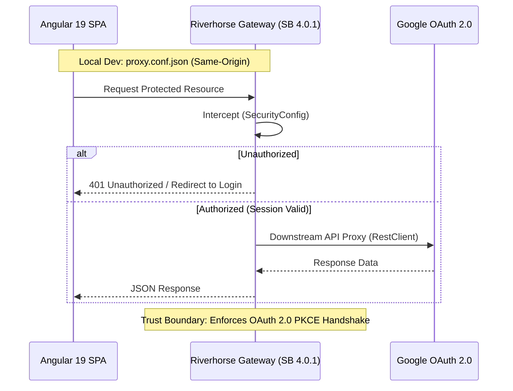

```mermaid
sequenceDiagram
    participant SPA as Angular 19 SPA
    participant BFF as Riverhorse Gateway (SB 4.0.1)
    participant Google as Google OAuth 2.0
    
    Note over SPA, BFF: Local Dev: proxy.conf.json (Same-Origin)
    
    SPA->>BFF: Request Protected Resource
    BFF->>BFF: Intercept (SecurityConfig)
    alt Unauthorized
        BFF-->>SPA: 401 Unauthorized / Redirect to Login
    else Authorized (Session Valid)
        BFF->>Google: Downstream API Proxy (RestClient)
        Google-->>BFF: Response Data
        BFF-->>SPA: JSON Response
    end
    
    Note over BFF: Trust Boundary: Enforces OAuth 2.0 PKCE Handshake
```

