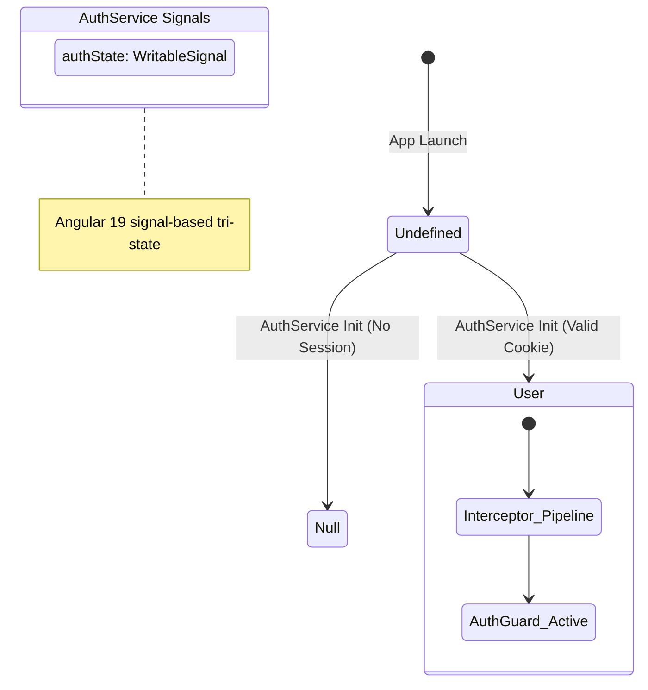

```mermaid
stateDiagram-v2
    [*] --> Undefined: App Launch
    Undefined --> Null: AuthService Init (No Session)
    Undefined --> User: AuthService Init (Valid Cookie)
    
    state User {
        [*] --> Interceptor_Pipeline
        Interceptor_Pipeline --> AuthGuard_Active
    }
    
    state "AuthService Signals" as Signals {
        direction LR
        state "authState: WritableSignal" as State
    }
    
    Note right of Signals: Angular 19 signal-based tri-state
```

