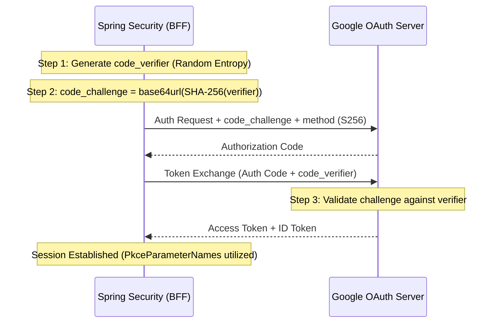

```mermaid
sequenceDiagram
    participant Client as Spring Security (BFF)
    participant Provider as Google OAuth Server
    
    Note over Client: Step 1: Generate code_verifier (Random Entropy)
    Note over Client: Step 2: code_challenge = base64url(SHA-256(verifier))
    
    Client->>Provider: Auth Request + code_challenge + method (S256)
    Provider-->>Client: Authorization Code
    
    Client->>Provider: Token Exchange (Auth Code + code_verifier)
    Note over Provider: Step 3: Validate challenge against verifier
    
    Provider-->>Client: Access Token + ID Token
    Note over Client: Session Established (PkceParameterNames utilized)
```

