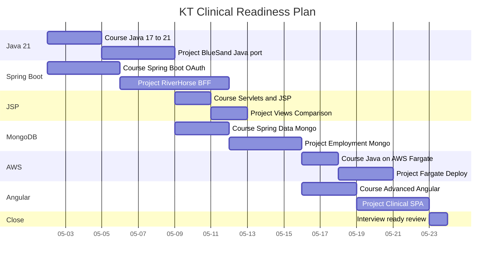

# KT Clinical Readiness Plan

Author John Green. Saga KTS-0000002. Generated 2026-05-02.

This is the study and project plan for the BRAND-healthcare-client-XYZ stack translation. Six tracks, each with a Course and a Project. Three week target. Dates are illustrative and shift as work proceeds.

The chart below renders in GitHub markdown, VSCode with Markdown Preview Mermaid Support, Obsidian, and mermaid.live. Conservative ASCII only per CRSD mitigation.

## How to read

Each row is one track. Track names appear on the left. Bars show calendar duration. Project bars start after the matching Course bar finishes. Tracks run in parallel where they do not contend for the same study sessions.

## How to comment

If reviewing this in GitHub, open an issue against the repository and reference the row name and date. If reviewing in Obsidian, add comments inline below this section. If reviewing in VSCode, use the Comments extension or annotate inline.

## Constraints honored

- No colons inside task names. Colons are field separators in Mermaid Gantt grammar.
- No square brackets, parentheses, hashes, pipes, semicolons, or quotes inside task names.
- ASCII only. No em-dashes. No smart quotes.
- Task IDs are short alphanumeric so the after keyword resolves predictably across parsers.
- Dates explicit in YYYY-MM-DD; axisFormat keeps the rendered axis short.

## Save location

Vault path C colon backslash <work-laptop-hostname> backslash KT backslash clinical backslash Readiness backslash 05_Wiki backslash plan-gantt.md
